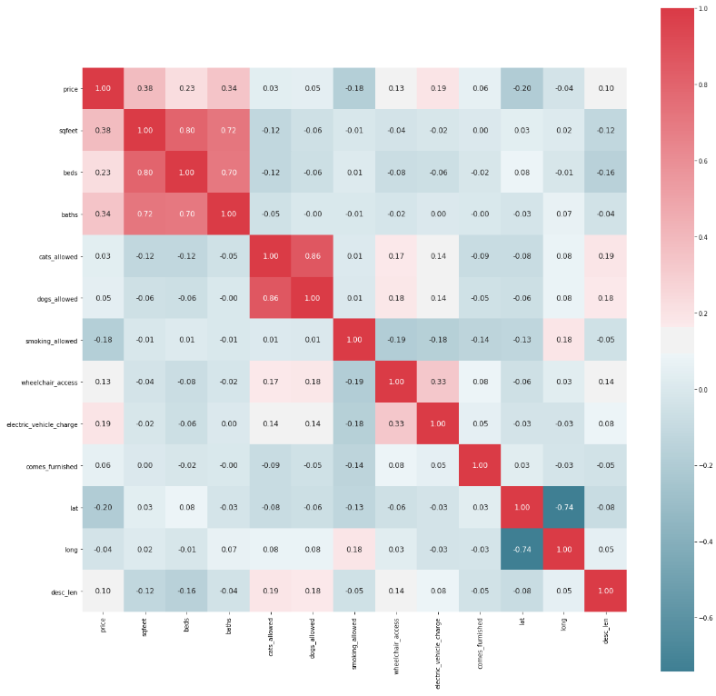
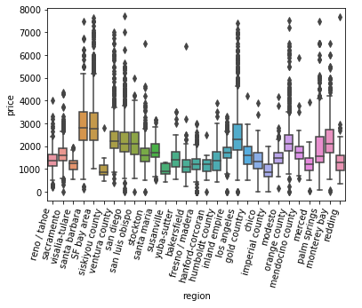
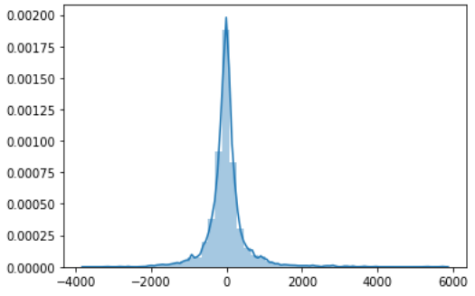

# California Housing Price Projection: Project Overview

* Analyzed California Craigslist home listings to predict rent per month using regression models
* Optimized Linear Regression, Lasso Regression, Support Vector Machines, and Random Forest using RandomSearchCV to reach the best model
* Performed text analysis of housing descriptions provided on Craigslist

## Code and Resources Used
<strong>Python Version</strong>: 3.7.6

<strong>Packages</strong>: pandas, numpy, scikit-learn, matplotlib, seaborn

<strong>Kaggle Dataset</strong>: https://www.kaggle.com/austinreese/usa-housing-listings

## Data Cleaning

After acquiring the data, I needed to clean it so that it was usable for the model. I made the following changes:

* Added column with the number of other listings the merchant has in the data
* Cleaned various NaN and null entries within the dataset
* Removed unrelated data columns (e.g. listing id on Craiglist)
* Removed outlier variables

## Exploratory Data Analysis

I performed EDA on the data to further clean and process the data before proceeding to build the model. Here are some of the highlights of the EDA.

  

  
   

## Model Building

A train-test split was performed on the dataset with a test size of 20%. Furthermore, k-fold cross validation was utilized as a means of estimating the in-sample error with k = 10. 

Regarding the description processing, I found the most commmon words and phrases within the description. Ultimately, I decided against using this data in the model as the most common phrases seemed to arise from multiple listings from the same lister.

Four machine learning algorithms were considered for this data including:

* Linear Regression - Basis model for the regression problem
* Lasso Regression - Similar to linear regression, but with regularization to control for overfitting
* Random Forest - Ensemble method with strong performance
* Support Vector Machine - Considered for linear model

### Hyperparameter Optimization

Upon training the models, the following in-sample errors (RMSE, units in dollars) were found:

* Linear Regression: RMSE = 572.57
* Lasso Regression: RMSE = 572.57
* Random Forest: RMSE = 515.12
* Support Vector Machine: RMSE = 516.02

The SVM and Random Forest models performed very similarly. I decided to tune the Random Forest using RandomizedSearchCV to save time.

## Model Performance

Upon calculating the out-of-sample error for the test set, these were the values:

* Linear Regression: RMSE = 613.98
* Lasso Regression: RMSE = 617.18
* Random Forest: RMSE = 542.17
* Support Vector Machine: RMSE = 907.43

The out-of-sample error for all models was greater than the in-sample error. SVM in particular had an extremely egregious error after predicting on the test set. Random Forest continued to perform the best of the models with a RMSE of 542.17.

The error of the Random Forest also followed a relatively normal distribution as can be seen below.

  

